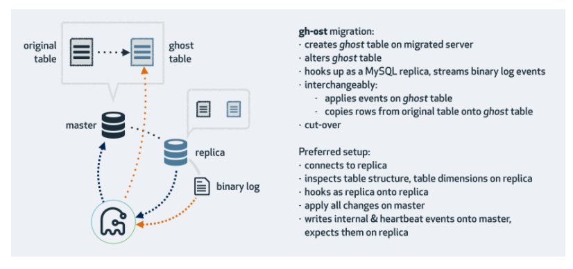
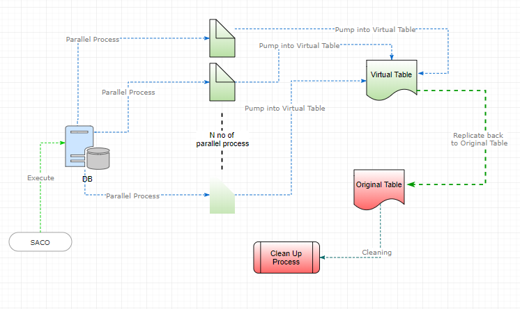
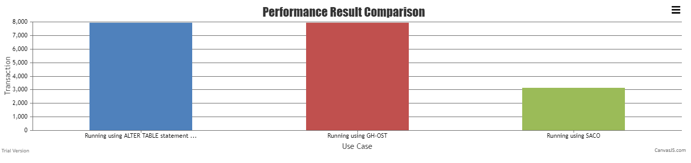

# SATO / SACO
Shahril - Alter Table Online Fast

### Problem

Sometimes when we design a thing, we didn't think through it in detail, forecast the next growth possibility etc. When things like this happen, it's often for us to make rapid changes on modifying the table or column design to meet our current requirement or improving current bottleneck. It is a normal process to do this practice but when it happens to a highly used table or table that currently containing big data or several number of index, doing modification or DDL statement are not as easy as it thinks.

This was due to time constraint that needed to finish the process and in meantimes reduces as many transaction locks as you can.


### Solution

For MySQL specifically, to make an alteration to a table or modification on a column, you need to execute an ALTER command. Unfortunately, doing alter statement will automatically produce TABLE LOCKS which cause the related table unable to produce any DML statement including SELECTs .This was due to ensure consistency process and redefining the index that related to the column changes.


Below are the example :-

```shell
SQL> Alter TABLE testing_exercises MODIFY COLUMN subject_id INT(11) default 0; 

cat result.log
18:03:11
20:15:25

Time Taken: 7939 seconds
```

Another solution than claim to be the fastest process yet was by using GH-OST , The design as per claim are like below :-



It is a triggerless online schema migration solution for MySQL. It produce a light workload on Master by making needed changes on replica sides, once done it will send the bin log changes on transaction to entire environment to be committed. This concept really helpful to be done on clustering environment by leveraging the load to several server, unfortunately it's not making much improvement if you are running under single server or multi-master environment. The target are main to cater huge tables, by that the assumption that your database should have already cater for clustering strategy.


Below are the example :-

```shell
# /opt/gh-ost \
--initially-drop-ghost-table --initially-drop-old-table --allow-on-master \
--host=127.0.0.1 --user=shahril --password --database=quiz --table=results_exercises \
--alter="MODIFY COLUMN subject_id INT(11) default 0" \
--chunk-size=8000 --max-load=Threads_connected=50 \
--execute > result.ghost.log 

# tail -20 result.ghost.log
# Migrating martini-box.localnet:3306; inspecting martini-box.localnet:3306; executing on martini-box.localnet
# Migration started at Tue Feb 27 10:45:14 +0800 2018
# chunk-size: 8000; max-lag-millis: 1500ms; dml-batch-size: 10; max-load: Threads_connected=50; critical-load: ; nice-ratio: 0.000000
# throttle-additional-flag-file: /tmp/gh-ost.throttle
# Serving on unix socket: /tmp/gh-ost.quiz_prod.results_exercises.sock
Copy: 25408000/23252236 109.3%; Applied: 0; Backlog: 0/1000; Time: 2h10m0s(total), 2h10m0s(copy); streamer: binlog.000004:391045568; State: migrating; ETA: due
Copy: 25512000/23252236 109.7%; Applied: 0; Backlog: 0/1000; Time: 2h10m30s(total), 2h10m30s(copy); streamer: binlog.000004:400475233; State: migrating; ETA: due
Copy: 25600000/23252236 110.1%; Applied: 0; Backlog: 0/1000; Time: 2h11m0s(total), 2h11m0s(copy); streamer: binlog.000004:408674961; State: migrating; ETA: due
Copy: 25696000/23252236 110.5%; Applied: 0; Backlog: 0/1000; Time: 2h11m30s(total), 2h11m30s(copy); streamer: binlog.000004:417496372; State: migrating; ETA: due
Copy: 25792000/23252236 110.9%; Applied: 0; Backlog: 0/1000; Time: 2h12m0s(total), 2h12m0s(copy); streamer: binlog.000004:426269847; State: migrating; ETA: due
Copy: 25802781/25802781 100.0%; Applied: 0; Backlog: 0/1000; Time: 2h12m3s(total), 2h12m3s(copy); streamer: binlog.000004:427083650; State: migrating; ETA: due
# Migrating `quiz_prod`.`results_exercises`; Ghost table is `quiz_prod`.`_results_exercises_gho`
# Migrating martini-box.localnet:3306; inspecting martini-box.localnet:3306; executing on martini-box.localnet
# Migration started at Tue Feb 27 10:45:14 +0800 2018
# chunk-size: 8000; max-lag-millis: 1500ms; dml-batch-size: 10; max-load: Threads_connected=50; critical-load: ; nice-ratio: 0.000000
# throttle-additional-flag-file: /tmp/gh-ost.throttle
# Serving on unix socket: /tmp/gh-ost.quiz_prod.results_exercises.sock
Copy: 25802781/25802781 100.0%; Applied: 0; Backlog: 0/1000; Time: 2h12m4s(total), 2h12m3s(copy); streamer: binlog.000004:427322065; State: migrating; ETA: due
Copy: 25802781/25802781 100.0%; Applied: 0; Backlog: 0/1000; Time: 2h12m5s(total), 2h12m3s(copy); streamer: binlog.000004:427323732; State: migrating; ETA: due
# Done

Time Taken : 7923 seconds

```

### Alternatives

Looking through the limitation, it is important to understand our own environment process to produce the best solution that can think of. Due to that as alternative, I've produce another workaround for this called SACO, basically the design should look this below :-



The process basically are doing as per below :-

    Parsing related column and changes needed
    Split large data into numerous of parallel chunk
    Pump into Virtual Table
    During the time, creating temporary trigger to cater newly data that inserted into related table during process running
    Once done, replicate the Virtual table to Original table
    Cleaning all temporary information


Script can be taken here

Below are the example :-

```shell
	/opt/SACO.sh [user] [port] [db_name related] [table_name related] [column_name related] [datatype want to change] [default_value want to add] [datatype_length want to change]
```

Example: 
```shell
# /opt/SACO.sh bkp_login 3306 quiz results_exercises subject_id INT 0 11

# tail -10 result.SACO.log
Start change datatype for  at Tue Feb 27 19:39:17 +08 2018
Process end at Tue Feb 27 19:40:18 +08 2018
====================================================================
Start process at Tue Feb 27 19:50:24 +08 2018
Start change datatype for subject_id at Tue Feb 27 19:50:25 +08 2018
Process end at Tue Feb 27 19:51:49 +08 2018
====================================================================
Start process at Tue Feb 27 19:55:09 +08 2018
Start change datatype for subject_id at Tue Feb 27 19:55:10 +08 2018
Process end at Tue Feb 27 20:46:59 +08 2018

Time Taken : 3120 seconds
```


Results Comparison





